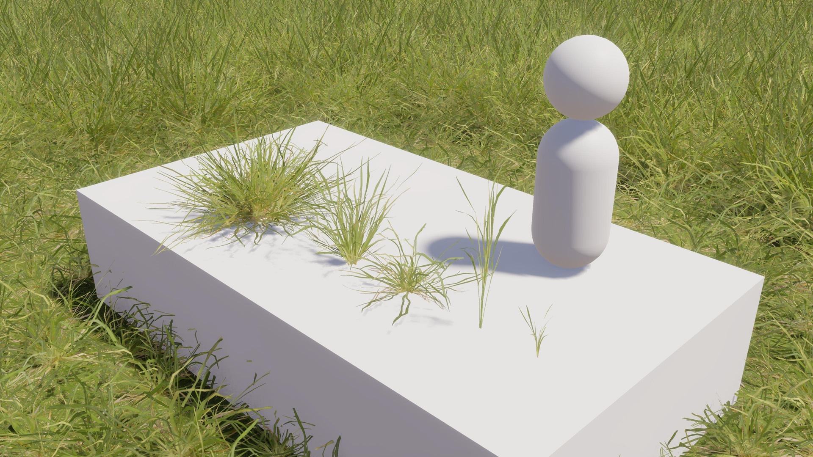
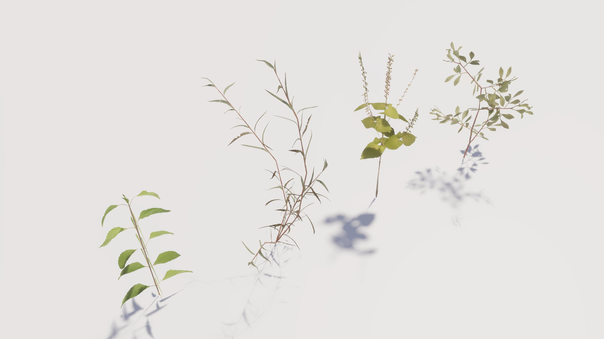

# 説明

UnityのHDRP向けの、Terrainで使用できる草アセット群です。

# 利用方法

このリポジトリをダウンロードし、Assetsフォルダ内から必要なファイルを取り出してください。

- FBX形式の3Dモデルが「Assets」→「Details」→「Meshes」フォルダ内にあります。
- テクスチャは「Assets」→「Details」→「Materials」フォルダ内にあります。

あるいは、以下のURLから元データ(Blender形式)を含めダウンロードする事も出来ます。リンク先のファイルも同じライセンスで利用できます。

## 「草」(3Dモデル5種類+地面テクスチャ)
### サンプル画像

### DLリンク
https://www.dropbox.com/scl/fo/m3n0e1ra70o3vs7d5d0zu/AL_mPCCAVg6ChnuRVtbJNAA?rlkey=tqlesshyrhepcwby6c6f4ef75&st=phqllvdz&dl=0

## 「草Ⅱ」(3Dモデル4種類)
### サンプル画像

### DLリンク
https://www.dropbox.com/scl/fo/7ar1qsbfrkfzf40v6a4ky/AFGE4WtMh4FU7OTUbSJu1YM?rlkey=qbbc86srfpg8lml60e01ygxtl&st=rwrxhp9q&dl=0

# 謝辞

このプロジェクトは、以下のCC0でライセンスされた著作物を利用して作成しました。
- 「Grass Medium 01」 (https://polyhaven.com/a/grass_medium_01)
- 「Shrub 01」 (https://polyhaven.com/a/shrub_01)
- 「Shrub 02」 (https://polyhaven.com/a/shrub_02)
- 「Shrub 03」 (https://polyhaven.com/a/shrub_03)
- 「Shrub 04」 (https://polyhaven.com/a/shrub_04)
